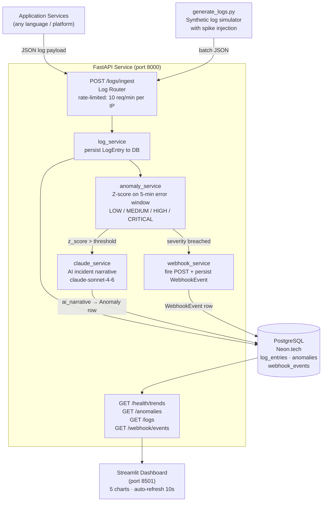

# Observability Watchdog — Architecture Deck

> AI-generated architecture walkthrough for the Wolters Kluwer engineering assessment.
> Stack: FastAPI · PostgreSQL (Neon.tech) · Claude AI · Streamlit · uv

---

## 1. What It Is

**Observability Watchdog** is a Python-based, API-first service that:

1. **Ingests** structured application logs from any service via REST
2. **Detects** error spikes using Z-score statistical analysis over rolling 5-minute windows
3. **Narrates** every anomaly with a 3-sentence SRE-style incident summary generated by Claude AI
4. **Alerts** downstream systems via a simulated webhook pipeline
5. **Visualises** health trends and anomaly history in a live Streamlit dashboard

It demonstrates production-grade async Python patterns, LLM integration, and observability principles aligned with the Wolters Kluwer engineering assessment.

---

## 2. Problem Statement

Modern distributed systems generate thousands of log lines per minute. Operators need to know:

- **When** error rates cross thresholds (not just that an error occurred)
- **Why** — a human-readable root cause hypothesis, not a raw log dump
- **What to do** — an actionable summary for the on-call engineer

Traditional log aggregators show counts. This service adds the _"so what"_ layer using statistical detection + LLM reasoning.

---

## 3. System Architecture



---

## 4. Data Models

### `log_entries`

| Column         | Type        | Notes                              |
| -------------- | ----------- | ---------------------------------- |
| `id`           | UUID PK     |                                    |
| `service_name` | VARCHAR     | e.g. `"auth-service"`              |
| `level`        | ENUM        | ERROR / WARN / INFO / DEBUG        |
| `message`      | TEXT        |                                    |
| `timestamp`    | TIMESTAMPTZ | Log emission time (client-supplied)|
| `created_at`   | TIMESTAMPTZ | Server ingestion time              |
| `metadata_`    | JSONB       | Optional structured context        |

### `anomalies`

| Column         | Type        | Notes                              |
| -------------- | ----------- | ---------------------------------- |
| `id`           | UUID PK     |                                    |
| `service_name` | VARCHAR     | Service that triggered detection   |
| `detected_at`  | TIMESTAMPTZ |                                    |
| `severity`     | ENUM        | LOW / MEDIUM / HIGH / CRITICAL     |
| `error_count`  | INTEGER     | Errors in the detection window     |
| `z_score`      | FLOAT       | Deviation from rolling mean        |
| `ai_narrative` | TEXT        | Claude-generated incident summary  |
| `webhook_fired`| BOOLEAN     | Whether a webhook was dispatched   |

### `webhook_events`

| Column            | Type        | Notes                                          |
| ----------------- | ----------- | ---------------------------------------------- |
| `id`              | UUID PK     |                                                |
| `anomaly_id`      | UUID FK     | References `anomalies.id`                      |
| `fired_at`        | TIMESTAMPTZ |                                                |
| `payload`         | JSONB       | Full anomaly payload sent to the webhook target |
| `response_status` | INTEGER     | HTTP response status from the webhook sink     |

---

## 5. Log Ingestion Pipeline

```
Client  →  POST /logs/ingest  →  slowapi rate limiter (10/min per IP)
                                        ↓
                               Pydantic validation
                               (LogEntryCreate schema)
                                        ↓
                               log_service.create_log_entry()
                               OR
                               log_service.create_log_entries_bulk()
                                        ↓
                               SQLAlchemy async session
                               → INSERT INTO log_entries
                                        ↓
                               run_anomaly_check() [background, non-blocking]
                                        ↓
                               201 Created → LogEntryResponse
```

**Design choices:**
- Batch endpoint accepts `list[LogEntryCreate]` — spike generators send 30 errors in a single request instead of 30 separate requests, keeping well under the per-IP rate limit
- `run_anomaly_check` is called after the response is committed; a crash in detection never returns a 5xx to the log producer
- `metadata_` column uses JSONB so arbitrary structured context can be attached without schema changes

---

## 6. Anomaly Detection

```python
# Simplified algorithm in anomaly_service.py / anomaly_detector.py

# 1. Count errors in the last 5 minutes for this service
recent_error_count = await count_recent_errors(db, service_name, window=5_min)

# 2. Load the rolling history (last N windows)
history = await get_error_history(db, service_name)

# 3. Z-score: how many standard deviations above the mean?
z_score = (recent_error_count - mean(history)) / stdev(history)

# 4. Trigger threshold — anything below 2.0 is normal
if z_score < 2.0:
    return  # no anomaly

# 5. Map Z-score to severity band
def _classify_severity(z_score: float) -> Severity:
    if z_score >= 5.0:  return Severity.CRITICAL
    if z_score >= 4.0:  return Severity.HIGH
    if z_score >= 3.0:  return Severity.MEDIUM
    return Severity.LOW  # 2.0 ≤ z < 3.0
```

**Why Z-score?**
- Adapts to each service's baseline automatically — a service that normally fires 100 errors/min needs a higher absolute threshold than one that fires 5
- Stateless per-request: no daemon, no scheduler — detection runs inline on every ingest call
- Transparent: the `z_score` field is returned in every anomaly response so operators can tune thresholds

---

## 7. Claude AI Integration

When an anomaly is detected, `claude_service.generate_narrative()` is called:

```python
# app/services/claude_service.py (simplified)

_client: AsyncAnthropic | None = None

def _get_client() -> AsyncAnthropic:
    global _client
    if _client is None:
        _client = AsyncAnthropic()
    return _client

async def generate_anomaly_narrative(result: AnomalyResult) -> str:
    message = await _get_client().messages.create(
        model=settings.claude_model,           # claude-sonnet-4-6
        max_tokens=settings.claude_max_tokens,  # 256
        system=ANOMALY_SYSTEM,                  # SRE persona + output rules
        messages=[{
            "role": "user",
            "content": _build_user_prompt(result),  # service, severity, z_score
        }],
    )
    return message.content[0].text
```

The prompt asks Claude to act as an SRE and produce a 2-3 sentence incident summary covering: what happened, likely root cause, and recommended immediate action.

**Test isolation:** The Anthropic client is injected via a module-level factory that tests replace with `AsyncMock`, so no real API calls are made in CI.

---

## 8. Webhook Pipeline

```
anomaly_service detects breach
        ↓
webhook_service.fire_webhook(anomaly_payload)
        ↓
httpx.AsyncClient.post(WEBHOOK_URL, json=payload)
        ↓
POST /webhook/receive (simulated sink)
    → persists WebhookEvent with response_status
        ↓
anomaly.webhook_fired = True  →  saved to DB
```

The `/webhook/receive` endpoint acts as a local sink. In production, `WEBHOOK_URL` would point to a real Slack incoming webhook, PagerDuty event API, or Teams connector.

---

## 9. Streamlit Dashboard

The dashboard (`dashboard/app.py`) is a minimal single-page layout designed around one question: _"Is anything wrong right now?"_

**Auto-refresh:** `streamlit-autorefresh` fires a full Streamlit rerun every 10 seconds — no JS hacks needed.

**Layout (top to bottom):**

```
┌─────────────────────────────────────────┐
│  ⊙ Watchdog          ● 18:21:38   ⚙ ▾  │  ← Header + live UTC clock + tweaks popover
├─────────────────────────────────────────┤
│         ACTIVE INCIDENT                  │
│       payment-service                   │  ← Status hero (red when anomaly,
│            75×                          │    green checkmark when all clear)
│      above normal                       │
│  [Investigate →]                        │
├─────────────────────────────────────────┤
│ LAST 24H · PAYMENT-SERVICE  peak 30/5m  │
│  ▁▁▁▁▁▁▁▁▁▁▁▁▁▁▁▁▁▁▁▁▁▁▁█•            │  ← Altair sparkline — white line,
│  06 PM               18:21             │    red anomaly dots, no y-axis
├─────────────────────────────────────────┤
│ RECENT                       3 events   │
│  ● 18:19  2m ago  payment-service 75×  │  ← Expandable rows with full
│  ● 10:57  7h ago  payment-service 75×  │    AI narrative + webhook status
├─────────────────────────────────────────┤
│ WATCHDOG          api → localhost:8000  │  ← Footer
└─────────────────────────────────────────┘
```

**Data sources:**

| Section | Endpoint | Notes |
| ------- | -------- | ----- |
| Status hero | `GET /anomalies` | First CRITICAL or HIGH anomaly |
| Sparkline | `GET /health/trends?hours=24` | Aggregated error count per 5-min bucket |
| Recent timeline | `GET /anomalies?limit=10` | All anomalies, expandable with narrative |

**Metric display modes** (selectable via ⚙ Tweaks popover):
- `× baseline` — multiplier (e.g. 75×)
- `0–100 score` — normalised anomaly score
- `Plain English` — "Severe spike", "Unusually high", etc.
- `Z-score` — raw statistical deviation

All sections degrade gracefully when the API is unreachable.

---

## 10. Key Technical Decisions

| Decision | Choice | Rationale |
| -------- | ------ | --------- |
| Database | PostgreSQL (Neon.tech) | Connection pooling, resilience, free tier; SQLite lacks async driver and connection pool support |
| Async driver | asyncpg | Fastest Postgres driver for Python; required by SQLAlchemy async |
| Package manager | uv | Replaces pip + venv in one tool; lockfile reproducibility; 10-100× faster installs |
| LLM | claude-sonnet-4-6 | Best reasoning-per-token in the Claude family; configurable via env var |
| Rate limiting | slowapi | FastAPI-native; per-endpoint, per-IP; minimal config overhead |
| Detection algorithm | Z-score | Self-calibrating to service baseline; transparent numeric output; no training data required |
| HTTP client | httpx | Async-native; same client used in FastAPI test fixtures (`AsyncClient`) |

---

## 11. Gaps & Roadmap

| Gap | Priority | Notes |
| --- | -------- | ----- |
| Authentication (JWT/OAuth2) | High | Deferred to keep MVP scope narrow; all write endpoints currently open |
| Test coverage (88% → 95%+) | Medium | Service-layer edge cases need integration tests |
| Docker Compose | Medium | API + dashboard containerised for one-command local setup |
| Cloud deployment | Medium | Azure App Service or AWS ECS with managed Postgres |
| OpenTelemetry tracing | Low | Distributed tracing across services via OTel SDK |
| Real webhook targets | Low | Slack / PagerDuty / Teams integration |
| Anomaly feedback loop | Low | Allow operators to mark false positives to tune Z-score thresholds |
